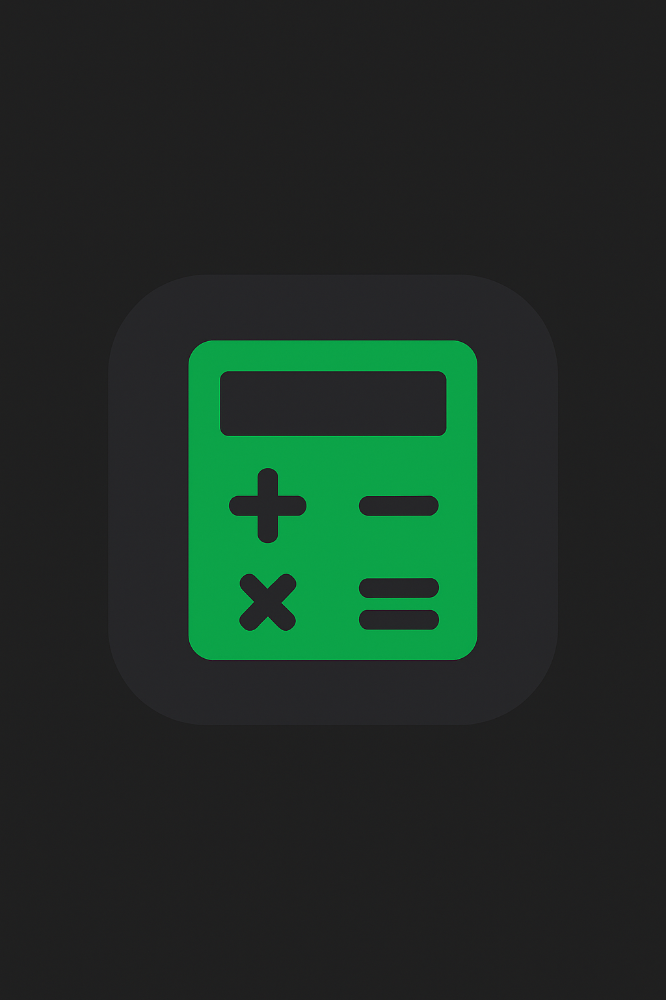

<div align="center">

# 🎓 GUC GPA Converter

### ✨ Transform Your GUC Grades to American Scale Instantly ✨



[](https://www.gpa-converter.sherlemious.com/)
[](https://github.com/Sherlemious/GUC-GPA-Converter)
[](https://www.sherlemious.com)

_Convert German University of Cairo (GUC) GPA to American GPA with precision using advanced interpolation algorithms_

</div>

---

## ✨ Features

<table>
<tr>
<td>

### 🎯 **Precision Accuracy**

Advanced interpolation for exact conversions

### 🔄 **Interactive Controls**

Custom spinner buttons for easy input

### 🚀 **Lightning Fast**

Pure JavaScript - no external dependencies

</td>
</tr>
</table>

### 📱 **Usage**

1. 📝 Enter your GUC GPA (0.7 - 5.0)
2. ⚡ Watch the magic happen instantly
3. 🎉 Get your American GPA result!

## 💻 Tech Stack & Architecture

<div align="center">


</div>

### 🏗️ **Project Structure**

```
GUC-GPA-Converter/
├── 📄 index.html      # Main application interface
├── ⚙️ index.js        # Core conversion algorithms
├── 🎨 (embedded CSS)  # Modern dark theme styles
├── 🌐 CNAME          # Custom domain configuration
├── 🖼️ icon.png       # Application favicon & icons
└── 📖 README.md      # You are here!
```

## 🌟 Why Choose This Converter?

<table>
<tr>
<td align="center">

### 🎯 **Accuracy**

Mathematical precision with interpolation algorithms

</td>
<td align="center">

### ⚡ **Speed**

Instant results with zero loading time

</td>
<td align="center">

### 🎨 **Design**

Beautiful, modern interface that's easy to use

</td>
</tr>
</table>

## 🛠️ Requirements

<div align="center">


**Any modern web browser** - That's it! 🎉

</div>

---

## 🙏 Acknowledgements

<div align="center">

💡 **Inspired by the need for accurate GUC-to-American GPA conversion**

🎓 **Built for students, by a student**

</div>

---

## 📞 Connect & Support

<div align="center">

### 👨‍💻 **Meet the Creator**

[](https://www.linkedin.com/in/sherlemious/)
[](https://www.sherlemious.com)
[](https://github.com/Sherlemious)

**Questions? Suggestions? Just want to say hi?**  
Feel free to reach out anytime!

</div>
